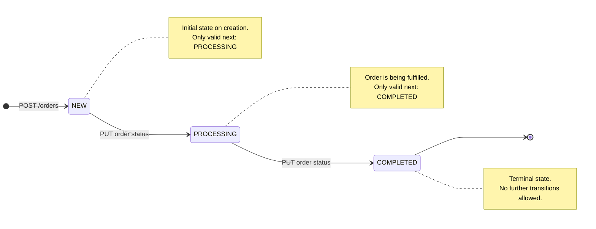
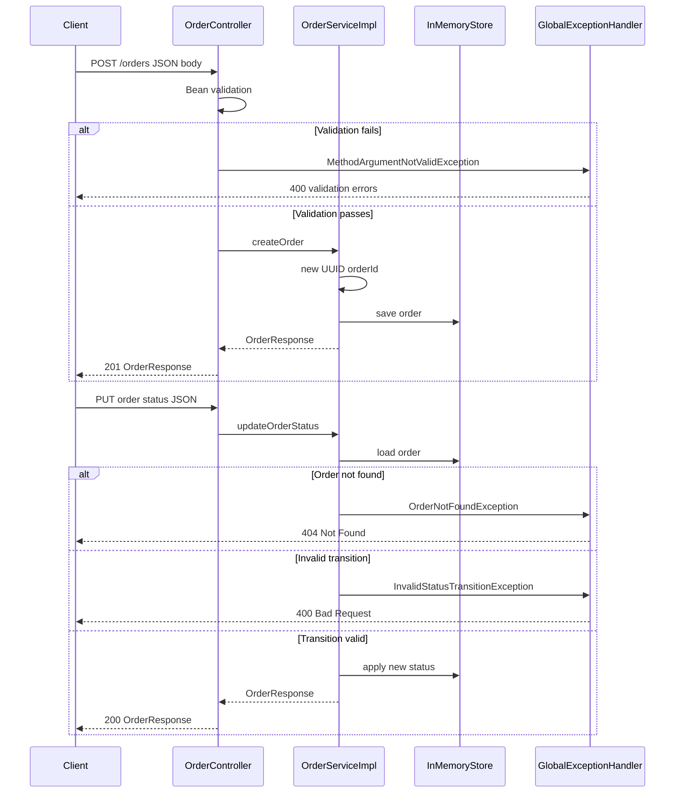
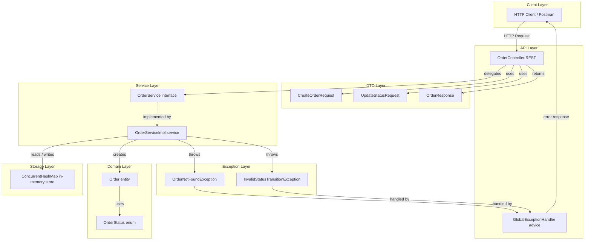
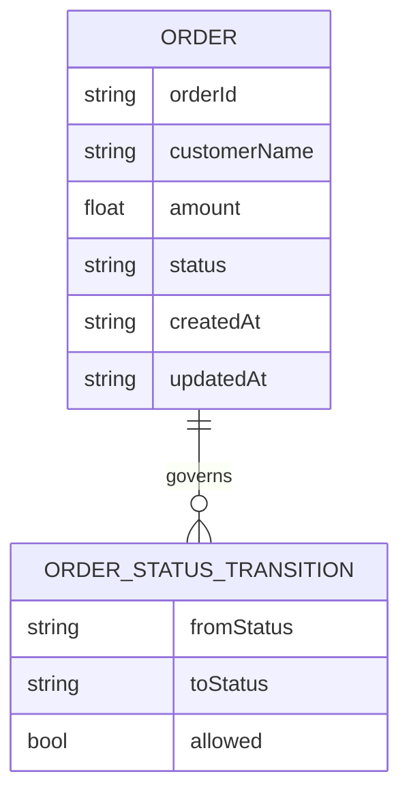
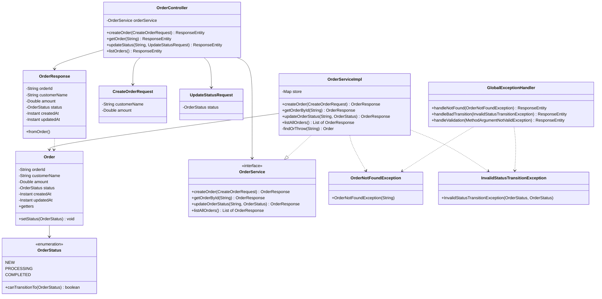

# Order Management Service

Spring Boot microservice exposing a REST API for orders with **in-memory** storage (`ConcurrentHashMap`), Bean Validation on DTOs, enforced status transitions, and centralized error handling via `@RestControllerAdvice`.

- **Java:** 17+  
- **Framework:** Spring Boot 4.x  
- **Base URL:** `http://localhost:8080`

## API overview

| Method | Path | Description |
|--------|------|-------------|
| `POST` | `/orders` | Create order (`customerName`, `amount`) — returns `201` |
| `GET` | `/orders/{orderId}` | Get order by id |
| `PUT` | `/orders/{orderId}/status` | Update status (`PROCESSING` \| `COMPLETED`) |
| `GET` | `/orders` | List all orders |

## Status rules

Valid transitions: **NEW → PROCESSING → COMPLETED**. Terminal state **COMPLETED** allows no further changes.

## Run

```bash
./mvnw.cmd spring-boot:run
./mvnw.cmd test
```

---

## Postman

Import the collection into Postman:

1. **Import** → **Upload Files** → select  
   [`postman/Order_Management_Service.postman_collection.json`](postman/Order_Management_Service.postman_collection.json)
2. Open the collection **Order Management Service**.
3. **Variables** (collection tab):
   - `baseUrl` — default `http://localhost:8080` (change if your server uses another host/port).
   - `orderId` — left empty until you run **Create Order**; the collection **Tests** script saves `orderId` from the `201` response automatically.

Suggested order: **Create Order** → **Update Status — PROCESSING** → **Update Status — COMPLETED** → **Get Order By Id** / **List All Orders**. The **Examples / Errors** folder contains requests that expect `400` / `404`.

---

## curl reference

Use **`curl.exe`** on Windows PowerShell so you invoke real curl (not the `Invoke-WebRequest` alias). Replace `YOUR_ORDER_ID` with a real id from **Create Order**. Examples use `http://localhost:8080`.

### Standard error body shape

Validation (`400`):

```json
{
  "timestamp": "2026-05-12T18:00:00.123456789Z",
  "status": 400,
  "error": "Bad Request",
  "message": "Validation failed",
  "errors": [
    "customerName: customerName is mandatory",
    "amount: amount must be greater than 0"
  ]
}
```

Other errors (`400` / `404`) omit `errors` and put detail in `message`:

```json
{
  "timestamp": "2026-05-12T18:00:00.123456789Z",
  "status": 404,
  "error": "Not Found",
  "message": "Order not found: fake-id"
}
```

### Order JSON shape (success)

All successful order payloads share this structure (`Instant` fields are ISO-8601):

```json
{
  "orderId": "a1b2c3d4-e5f6-7890-abcd-ef1234567890",
  "customerName": "Alice Johnson",
  "amount": 149.99,
  "status": "NEW",
  "createdAt": "2026-05-12T18:00:00.123456789Z",
  "updatedAt": "2026-05-12T18:00:00.123456789Z"
}
```

---

### 1. Create order — `POST /orders`

**Request**

```http
POST /orders HTTP/1.1
Host: localhost:8080
Content-Type: application/json

{
  "customerName": "Alice Johnson",
  "amount": 149.99
}
```

**curl**

```bash
curl -s -X POST http://localhost:8080/orders \
  -H "Content-Type: application/json" \
  -d '{"customerName":"Alice Johnson","amount":149.99}'
```

**Response `201 Created`** — body is one `Order` object; `orderId` is generated; `status` is always `NEW` initially.

```json
{
  "orderId": "f47ac10b-58cc-4372-a567-0e02b2c3d479",
  "customerName": "Alice Johnson",
  "amount": 149.99,
  "status": "NEW",
  "createdAt": "2026-05-12T18:05:00.123456789Z",
  "updatedAt": "2026-05-12T18:05:00.123456789Z"
}
```

**Response `400`** — missing/invalid fields (example: blank name, non-positive amount):

```bash
curl -s -X POST http://localhost:8080/orders \
  -H "Content-Type: application/json" \
  -d '{"customerName":"","amount":10}'
```

```bash
curl -s -X POST http://localhost:8080/orders \
  -H "Content-Type: application/json" \
  -d '{"customerName":"Bob","amount":0}'
```

---

### 2. List all orders — `GET /orders`

**Request**

```http
GET /orders HTTP/1.1
Host: localhost:8080
```

**curl**

```bash
curl -s http://localhost:8080/orders
```

**Response `200 OK`** — JSON array of orders (empty array `[]` if none).

```json
[
  {
    "orderId": "f47ac10b-58cc-4372-a567-0e02b2c3d479",
    "customerName": "Alice Johnson",
    "amount": 149.99,
    "status": "PROCESSING",
    "createdAt": "2026-05-12T18:05:00.123456789Z",
    "updatedAt": "2026-05-12T18:06:00.123456789Z"
  }
]
```

---

### 3. Get order by id — `GET /orders/{orderId}`

**Request**

```http
GET /orders/f47ac10b-58cc-4372-a567-0e02b2c3d479 HTTP/1.1
Host: localhost:8080
```

**curl**

```bash
curl -s http://localhost:8080/orders/YOUR_ORDER_ID
```

**Response `200 OK`** — single order object (same shape as create response).

**Response `404`** — unknown id:

```bash
curl -s http://localhost:8080/orders/does-not-exist
```

```json
{
  "timestamp": "2026-05-12T18:10:00.123456789Z",
  "status": 404,
  "error": "Not Found",
  "message": "Order not found: does-not-exist"
}
```

---

### 4. Update order status — `PUT /orders/{orderId}/status`

**Request (NEW → PROCESSING)**

```http
PUT /orders/f47ac10b-58cc-4372-a567-0e02b2c3d479/status HTTP/1.1
Host: localhost:8080
Content-Type: application/json

{
  "status": "PROCESSING"
}
```

**curl**

```bash
curl -s -X PUT http://localhost:8080/orders/YOUR_ORDER_ID/status \
  -H "Content-Type: application/json" \
  -d '{"status":"PROCESSING"}'
```

**Response `200 OK`**

```json
{
  "orderId": "f47ac10b-58cc-4372-a567-0e02b2c3d479",
  "customerName": "Alice Johnson",
  "amount": 149.99,
  "status": "PROCESSING",
  "createdAt": "2026-05-12T18:05:00.123456789Z",
  "updatedAt": "2026-05-12T18:07:00.123456789Z"
}
```

**Request (PROCESSING → COMPLETED)**

```bash
curl -s -X PUT http://localhost:8080/orders/YOUR_ORDER_ID/status \
  -H "Content-Type: application/json" \
  -d '{"status":"COMPLETED"}'
```

**Response `200 OK`** — same shape; `status` is `COMPLETED`; `updatedAt` changes.

**Response `400`** — invalid transition (e.g. `NEW` → `COMPLETED`, or any change from `COMPLETED`):

```bash
curl -s -X PUT http://localhost:8080/orders/YOUR_ORDER_ID/status \
  -H "Content-Type: application/json" \
  -d '{"status":"COMPLETED"}'
```

(Run that **before** moving to `PROCESSING`, or after the order is already `COMPLETED`.)

```json
{
  "timestamp": "2026-05-12T18:19:55.145024500Z",
  "status": 400,
  "error": "Bad Request",
  "message": "Cannot transition order from COMPLETED to COMPLETED"
}
```

**Response `400`** — missing `status` in body:

```bash
curl -s -X PUT http://localhost:8080/orders/YOUR_ORDER_ID/status \
  -H "Content-Type: application/json" \
  -d '{}'
```

---

### Windows PowerShell (line continuation `^`)

```powershell
curl.exe -s -X POST http://localhost:8080/orders ^
  -H "Content-Type: application/json" ^
  -d "{\"customerName\":\"Alice Johnson\",\"amount\":149.99}"

curl.exe -s http://localhost:8080/orders

curl.exe -s http://localhost:8080/orders/YOUR_ORDER_ID

curl.exe -s -X PUT http://localhost:8080/orders/YOUR_ORDER_ID/status ^
  -H "Content-Type: application/json" ^
  -d "{\"status\":\"PROCESSING\"}"

curl.exe -s -X PUT http://localhost:8080/orders/YOUR_ORDER_ID/status ^
  -H "Content-Type: application/json" ^
  -d "{\"status\":\"COMPLETED\"}"
```

---

## Diagrams

### Order lifecycle (state machine)



### Request flow (sequence)



### Component / architecture



### In-memory logical schema (ER diagram)

There is no physical database; this documents the logical data held in memory (it would map cleanly to a relational model if persisted later).



GitHub’s Mermaid renderer often fails when ER attribute comments contain **HTML-like tokens** (for example `>` or `|` inside quoted text). The diagram above avoids those characters so it can render reliably; see the prose and table below for full semantics.

**Valid transitions**

| From Status   | To Status     | Allowed |
|---------------|---------------|---------|
| `NEW`         | `PROCESSING`  | Yes     |
| `NEW`         | `COMPLETED`   | No      |
| `PROCESSING`  | `COMPLETED`   | Yes     |
| `PROCESSING`  | `NEW`         | No      |
| `COMPLETED`   | `NEW`         | No      |
| `COMPLETED`   | `PROCESSING`  | No      |

### Class diagram



## Package layout

Implementation lives under `com.Reflection.Order_management_service` with subpackages `controller`, `dto`, `exception`, `model`, and `service`.
