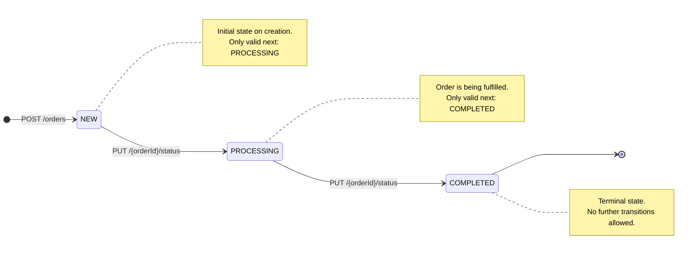
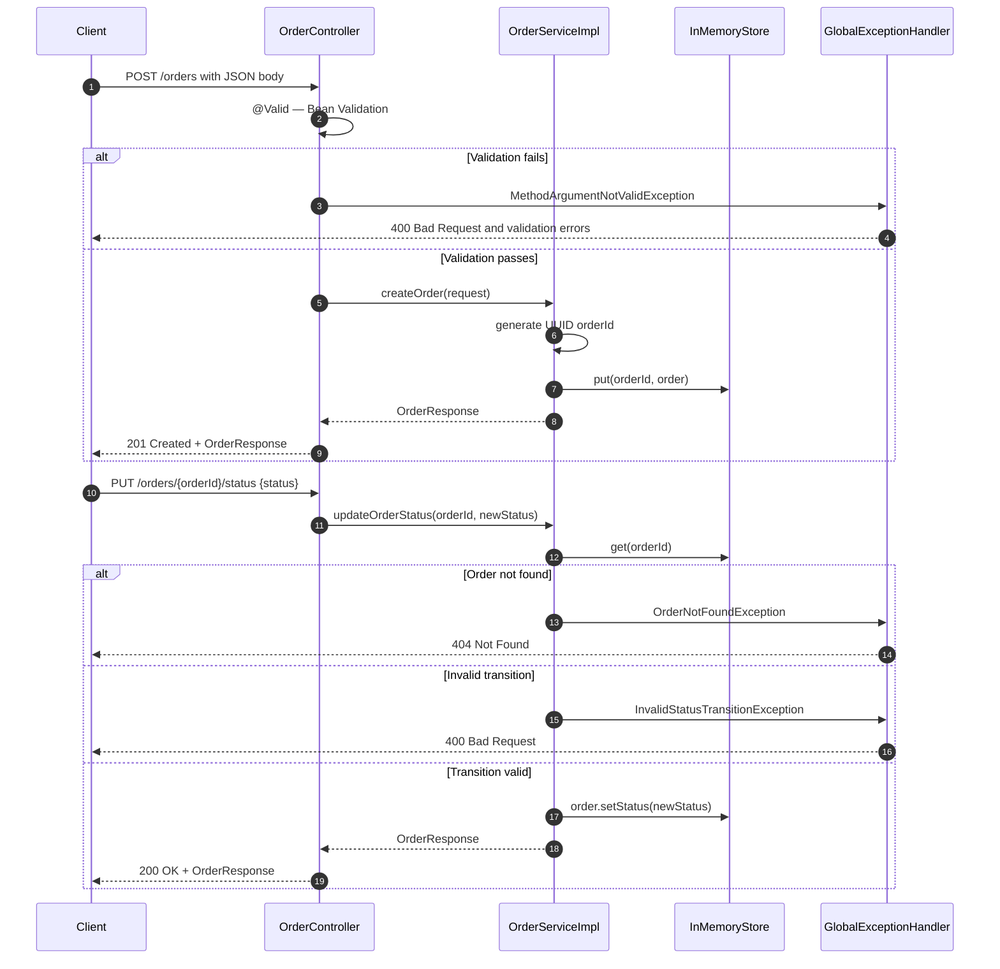
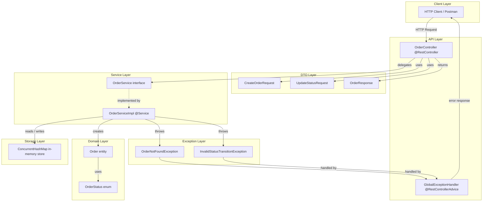
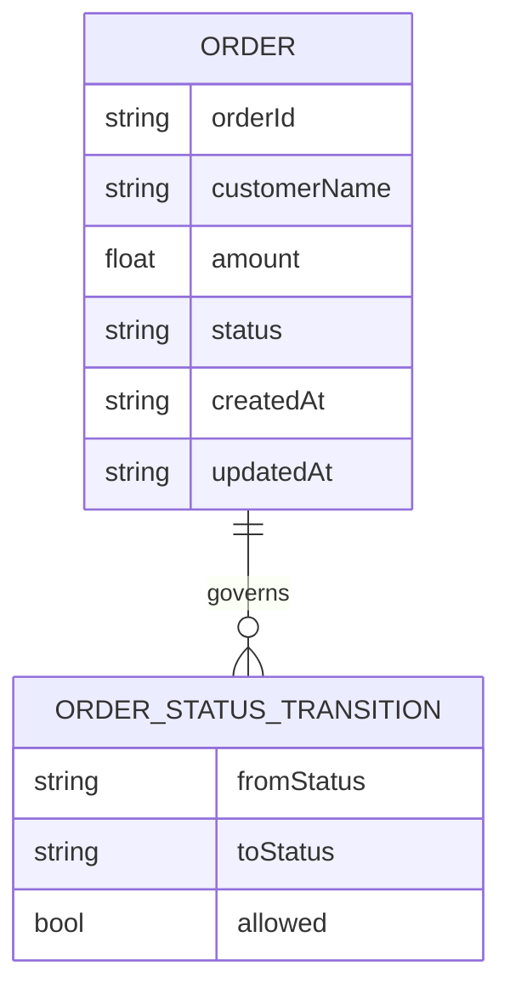

# Order Management Service

Spring Boot microservice exposing a REST API for orders with **in-memory** storage (`ConcurrentHashMap`), Bean Validation on DTOs, enforced status transitions, and centralized error handling via `@RestControllerAdvice`.

- **Java:** 17+  
- **Framework:** Spring Boot 4.x  
- **Base URL:** `http://localhost:8080`

## API overview

| Method | Path | Description |
|--------|------|-------------|
| `POST` | `/orders` | Create order (`customerName`, `amount`) — returns `201` |
| `GET` | `/orders/{orderId}` | Get order by id |
| `PUT` | `/orders/{orderId}/status` | Update status (`PROCESSING` \| `COMPLETED`) |
| `GET` | `/orders` | List all orders |

## Status rules

Valid transitions: **NEW → PROCESSING → COMPLETED**. Terminal state **COMPLETED** allows no further changes.

## Run

```bash
./mvnw.cmd spring-boot:run
./mvnw.cmd test
```

---

## Diagrams

### Order lifecycle (state machine)



### Request flow (sequence)



### Component / architecture



### In-memory logical schema (ER diagram)

There is no physical database; this documents the logical data held in memory (it would map cleanly to a relational model if persisted later).



GitHub’s Mermaid renderer often fails when ER attribute comments contain **HTML-like tokens** (for example `>` or `|` inside quoted text). The diagram above avoids those characters so it can render reliably; see the prose and table below for full semantics.

**Valid transitions**

| From Status   | To Status     | Allowed |
|---------------|---------------|---------|
| `NEW`         | `PROCESSING`  | Yes     |
| `NEW`         | `COMPLETED`   | No      |
| `PROCESSING`  | `COMPLETED`   | Yes     |
| `PROCESSING`  | `NEW`         | No      |
| `COMPLETED`   | `NEW`         | No      |
| `COMPLETED`   | `PROCESSING`  | No      |

### Class diagram


## Package layout

Implementation lives under `com.Reflection.Order_management_service` with subpackages `controller`, `dto`, `exception`, `model`, and `service`.
